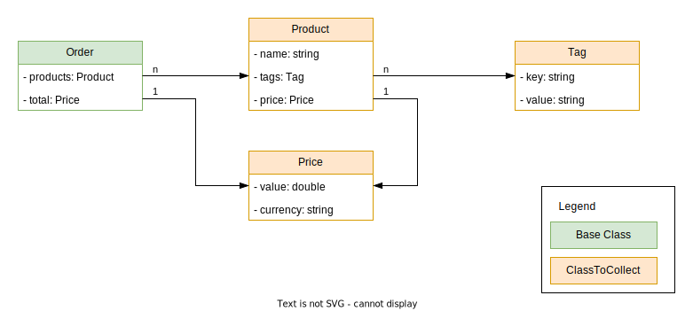

# PoCo - Pojo Collector 

## What is it?
It is a framework that makes it possible to create so-called collector classes. 
These collector classes collect all objects of nested types of a base object.

See the following sketch (not UML compliant) to get a (hopefully) better understanding what it is about.

The following classes are some plain old java objects which represents a simplified order in an e-commerce.


When you use PoCo to generate the collector-classes based on the order, you will get the following generated.


## Why could this be useful?
It can be useful if you have to work with complex objects, but only certain types are of interest for your own use case.

Let's assume we have an online store with a merchandise management system and we want to take stock. 
Then we may have orders (outgoing goods), stocks (inventory), returns (incoming goods), purchasing (incoming goods), etc.

All of these use cases have their own basic objects in which products are used, for example. This product data can in 
turn be used to carry out the inventory. However, you would first have to have the appropriate options for extracting 
the product data for each use case. And this is where PoCo comes into play, which can achieve exactly this by 
generating collector classes.

## How can I use it?
Currently, there is the possibility to integrate a gradle plugin into the build process which can generate the collector classes. 
Alternatively, you could also write your own CLI by including the project as dependency.

### Gradle plugin
To get started with the gradle plugin you should add it to your build.gradle in the plugins section.

### Plugin configuration
```kotlin
plugins {
    id("io.github.lumpytales.poco.gradle-plugin") version "0.1.0"
}
```
Beside that you also have to add the core-library and jakarta.annotation as dependency. Jakarta annotation is used to 
mark the classes as generated and use other informational annotations like "Nullable".
```kotlin
dependencies {
    implementation("io.github.lumpytales.poco:core:0.1.0")
    implementation("jakarta.annotation:jakarta.annotation-api:3.0.0-M1")
}
```
After all add the generated classes to you source-sets.
```kotlin
java.sourceSets["main"].java {
    srcDirs(
        project.layout.buildDirectory.dir("generated/sources/poco/src/main/java")
    )
}
```

### Task configuration
Then you are good to go and can add your own tasks to generate poco-classes.
```kotlin
tasks.register<io.github.lumpytales.poco.plugin.tasks.PocoGeneratorTask>("generateForOrder") {
    baseClass = "de.fun.Order" // class which contains classes to collect
    outputPackageName = "de.funny.order"
}
tasks.register<io.github.lumpytales.poco.plugin.tasks.PocoGeneratorTask>("generateForPet") {
    baseClass = "de.fun.Pet" // class which contains classes to collect
    outputPackageName = "de.funny.pet"
}
```

#### Configuration options
```kotlin
// class which contains classes to collect
baseClass = "de.fun.Order"

// package name which should be used for generated poco classes
outputPackageName = "de.funny.order"

// fully qualified name of classes which should be collected
classesToCollect = listOf("de.fun.Product", "de.fun.Amount")

// usually only collector classes are generated for classes which exists in the same package as the base class. Here we can add additional package names or even full qualified class names
additionalPackageOrClassNames = listOf("com.other.package.Price")

// whether to create the collector context or only the poco-classes
generateContext = true

// annotation which should be used to mark classes as generated
generatedAnnotation = "jakarta.annotation.Generated"

// annotation which should be used to mark fields etc. as nullable
nullableAnnotation = "jakarta.annotation.Nullable" 
```
**Note:** In case you don't need the collector context class you can set the flag "generateContext" to false. 
In such cases **you will have zero dependencies to this project** and don't have to add the dependency
```kotlin
dependencies {
    implementation("io.github.lumpytales.poco:core:0.1.0")
}
```
**Note:** In case you want to use your own generated and nullable annotations for the poco-classes, feel free to set the config 
"generatedAnnotation" and "nullableAnnotation" to a fully qualified class name which extends an annotation.

In such cases **you will have zero dependencies to the jakarta project** and don't have to add the dependency
```kotlin
dependencies {
    implementation("jakarta.annotation:jakarta.annotation-api:3.0.0-M1")
}
```

### Generated sources
After you generated the poco-classes you should find, next to the poco-classes, 
a class which implements the context-interface. You can directly use the poco-classes or alternatively
the context-implementation if you want to use pre-initialized poco-classes in some kind of dependency-injection fashion.

Folder-structure:
```text
build
|- generated
   |- sources
      | - poco
         |- src
            |- main
               |- java
                  |- de
                     |- funny
                        |- order
                           |- ProductCollector.java
                           |- TagCollector.java
                           |- CollectorContextImpl.java
```

## Licensing

This software is licensed under the MIT Licence. Note that poco has several dependencies which may have be bound to
other licenses than the MIT License. Note that using poco comes without any (legal) warranties.

### Roadmap
#### Q1 - 2024
##### [Container classes](https://github.com/LumpyTales/poco/issues/1)
Currently, there are some limitations according to the generated code. As the java-universe has a lot of different
classes which act as container (like a List.class, Map.class, ...) for Pojos, not all can be supported.

Right now the following containers/wrappers are supported:
```text
- List.class
- Map.class
```
In future there will be the possibility to inject additional or your own container classes.

##### [Collector and Context Interface](https://github.com/LumpyTales/poco/issues/3)
Currently, the collector-classes implement the standard interface "java.util.function.Function" 
and the collector-context-classes a specific, project dependent, interface 
"io.github.lumpytales.poco.core.CollectorContext". 

To get rid of this dependencies there should be an opportunity to allow the consumer of the plugin to define their own 
class which gets implemented. Of course, it must follow a specific pattern, but in that way we can reduce the dependencies
to this project to zero but keep full functionality!

#### Q2 - 2024

#### Q3 - 2024

#### Q4 - 2024